# CycleGAN and pix2pix in PyTorch applied to GenCP: Generative Control Point

GenCP is a project funded by ESA (European Space Agency) based on **CycleGAN and pix2pix in PyTorch**. 
Please refer to the original [README](#original-readme-from-cyclegan-and-pix2pix-in-pytorch) for more information.

The original code is licensed under the **BSD 3-Clause License**, and all copyright notices have been retained.

Minor changes have been made:
* LPIPS loss option has been added for training, see [training section](#training)
* Demonstration notebooks for high resolution (HR) and very high resolution (VHR) image GenCP images have been added


## GenCP
The scope of this project is to develop a proof of concept prototype prototype aiming to provide Generated Control Point (GenCP) image chips which are computed with generative AI techniques. The Ground Control Points (GCP) are involved in geometric Calibration / Validation activities of remote sensing images and are reference measurements.

The following picture illustrates the GenCP concept: image translation from map to synthetic satellite image

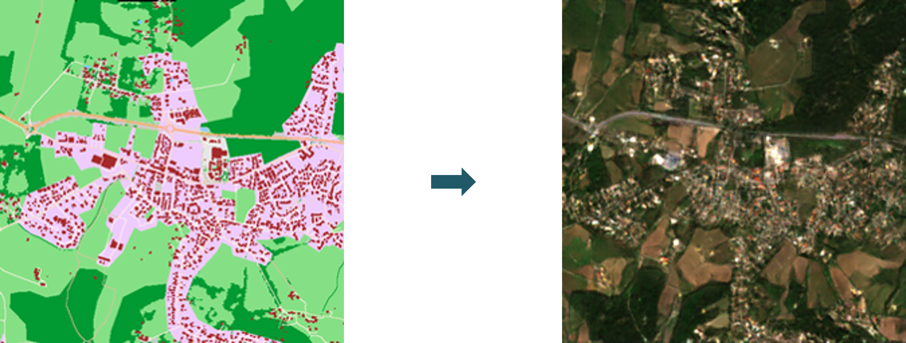


Currently, there are two common approaches to get GCP set:
*	Ground-based surveys, mostly using GNSS receivers with mm/cm level accuracy, that are suitable for manual labelling in images
*	Extraction from reference raster datasets, often Sentinel-2 mosaics (S2 GRI) or any other VHR images, for which uncertainties are known, and that is suitable for automatic image matching procedures.

In both cases, the reference points are provided to the user along with GCP image chips from an EO Sensor, including vector data and GNSS measurement (if available), or more straightforwardly a full raster reference data to sufficiently describe the point location. ESA is also aiming at the development and sharing of a comprehensive GCP DB, which requires clearly explained point locations together with accurate coordinates that need to be identified in the target image.

However, although the provision of GCP image chips is an efficient approach for user interpretation of a GCP in a target image (labelling), the sharing / distribution among community of original VHR data remain a critical issue because of copyright law / licensing policy.

Furthermore, even if some free ground photos or screenshots are available and so can be utilized as part of GCP description report, the photos or the views are not georeferenced, so GCP should be identified manually. As consequences, it limits considerably the usefulness of GCP data for geometric Cal/Val purposes.

The last but not least critical point is related to reference image chip; radiometric and geometric differences still exist between reference and target images; it results in accuracy loss in matching process.

In order to overcome these issues, an appropriate and ideal solution would be to generate synthetic GCP images, so called GenCP, with main purposes of using them as a geometric raster reference.

In the scope of this project, two AI models have been developed to support two different resolutions:
*	VHR with 50 cm images
*	HR with 10 m images

The following diagram illustrates the GenCP workflow:

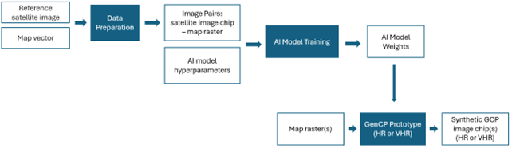

Note: image patches used for training and generated images are 8 bits images.


### Examples of generated images

TODO: add links to zenodo and QGISCloud if available

Below are some examples of HR generated images along with the corresponding reference S2 patches and OSM rasters.

OSM raster            |  Reference Image            |  Generated Image
:-------------------------:|:-------------------------:|:-------------------------:
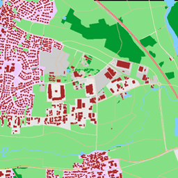  |  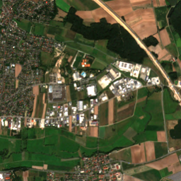 |  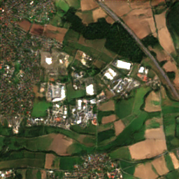
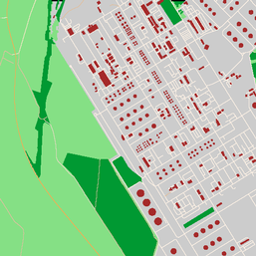  |  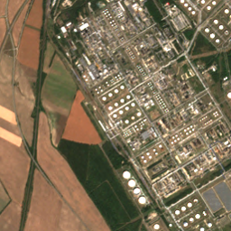 |  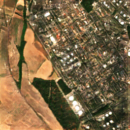
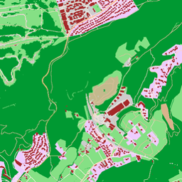  |  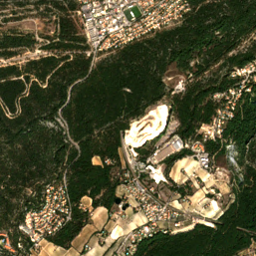 |  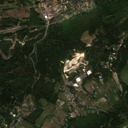
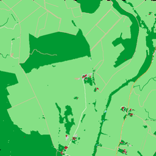  |  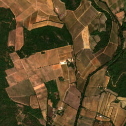 |  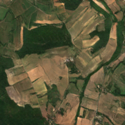
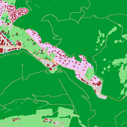  |  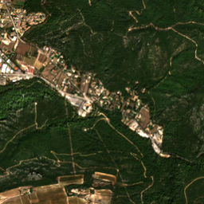 |  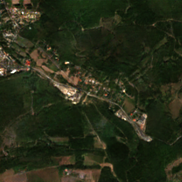

VHR examples are illustrated below, from UAV images.

OSM raster            |  Reference Image            |  Generated Image
:-------------------------:|:-------------------------:|:-------------------------:
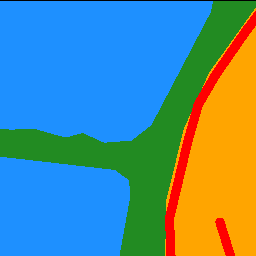  |  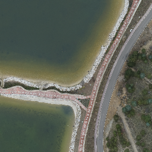 |  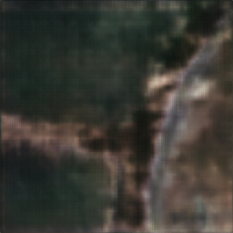
  |  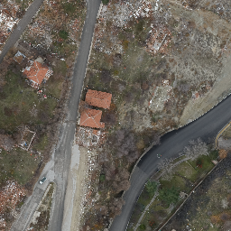 |  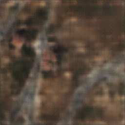
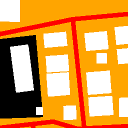  |  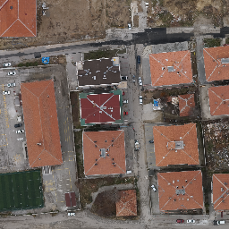 |  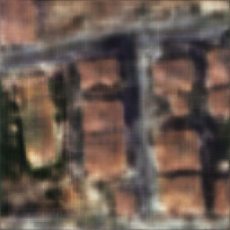
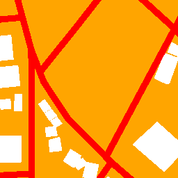  |  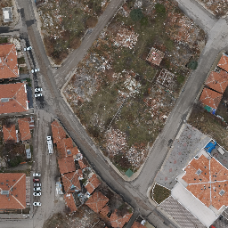 |  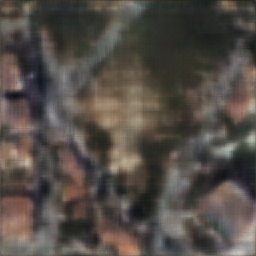
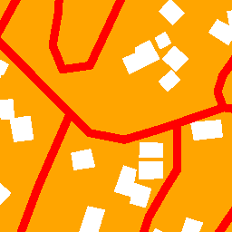  |  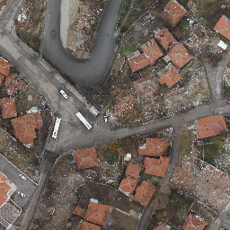 |  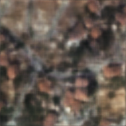

## Demo Notebooks

Two notebooks are available to demonstrates how to generate synthetic [HR](GenCP_HR_demo/GenCP_demo_HR.ipynb) and [VHR](GenCP_VHR_demo/GenCP_demo_VHR.ipynb) images from OSM rasters. 

Demonstration data is available for [HR](GenCP_HR_demo/data/dataset) and [VHR](GenCP_VHR_demo/gencp_VHR_data_test). The notebooks can also be used on users' OSM rasters. Please refer to the [data section](#data) to see guidelines on how to generate OSM rasters compatible with the models' weights provided.


## Data

For HR images, we provide a training dadaset of image pairs (S2 patches and correspond OSM rasters), avaible in [Zenodo]() (soon).

To generate your own OSM rasters, here are some guidelines:
* Use [osmnx library](https://osmnx.readthedocs.io/en/stable/getting-started.html) to download OSM vectors over your area of interest
* Define OSM feature's color for the rasterization based on the colors used in this project. [HR colors](GenCP_HR_demo/genCP_HR_osm_colors.py) and [VHR colors and width](GenCP_VHR_demo/genCP_VHR_osm_colors_and_width.py) describe the OSM features used in the GenCP project and their assigned colors (and width) to create OSM rasters. Note: for HR case, [CLC 10m raster](https://land.copernicus.eu/en/products/clc-backbone/clc-backbone-2021) was used in addition to OSM to fill missing values in OSM rasters, colors used are also defined in [HR colors](GenCP_HR_demo/genCP_HR_osm_colors.py).
* Use [GDAL](https://gdal.org/en/stable/programs/gdal_rasterize.html) to rasterize OSM vectors


## Training

Please refer to the original [README](#original-readme-from-cyclegan-and-pix2pix-in-pytorch) for guidelines on training.

For training on an aligned dataset, such as the HR dataset available in Zenodo, the following options and command can be used:

* Use `--dataroot` to indicate path to training dataset
* Use `--name` to name the experiment
* Use `--checkpoints_dir` to indicate path to checkpoints folder for saving model's weights
* Use `--direction BtoA` to change input and output domain from B to A (A to B by default)
* Use `--LPIPS` to replace L1 loss by LPIPS loss
* Use `--lambda_L1` to change lambda value (with L1 or LPIPS loss)

Set `--model` option to "pix2pix" to indicate that a Pix2Pix architecture is used.

```
   python train.py  --dataroot path/to/dataset  --name experiment_name --model pix2pix --LPIPS  --checkpoints_dir path/to/checkpoint_dir --direction BtoA
   
```

All options to select parameters and hyperparameters values are described in the [options folder](options).


## Testing
   
Please refer to the original [README](#original-readme-from-cyclegan-and-pix2pix-in-pytorch) for guidelines on testing.

For testing on source images only (map rasters) with the trained GenCP HR model, run the following command:

* Set `--model` to "test" to indicate testing mode
* Set `--dataset_mode` to "single" to indicate that only OSM rasters will be provided as inputs
* Set `--norm` to "batch" to indicate that batch normalization has been used during training
* Set `--netG` to "unet_256" to indicate that U-Net 256 was used as backbone for the generator during training

```
   python test.py  --dataroot path/to/dataset --name experiment_name --model test --results_dir /path/to/result_dir --checkpoints_dir path/to/checkpoint_dir --dataset_mode single --norm batch --netG unet_256
   
```


## Geo-referencing

Generated images by the AI model or not georeferenced. Use the following command to georeference generated images based on corresponding OSM rasters and create a GenCP database:

```
   python GenCP_HR_demo/gencp_georeferencing.py -t "path/to/generated/images" -i "path/to/input/OSM/rasters" -o "path/to/output/genCP_DB"
   
```

## Quality Control

Quality control is done with [KARIOS](https://github.com/telespazio-tim/karios) to evaluate the geometric accuracy of the geo-referenced generated images.

### HR results

The following figure illustrates geometric error distribution results obtained with KARIOS on a test site (not used for training) for RGB HR generated images. Results show a mean error around 0.7 pixel (7m) and a RMSE around 2.5 pixels (24m) due to outliers, mostly in rural areas.

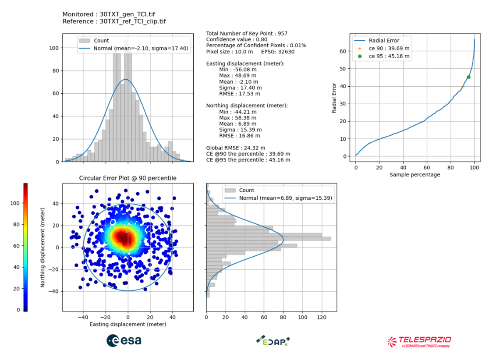

The following configuration was used:

Confidence value: 0.8

KLT Matching:
*	minDistance: 1
*	blocksize: 5
*	maxCorners: 0
*	matching_winsize: 15
*	quality_level: 0.1
*	xStart: 0
*	tile_size: 4000
*	laplacian_kernel_size: 7
*	outliers_filtering: true

### VHR results

The following figure illustrates geometric error distribution results obtained with KARIOS on a test site (not used for training) for RGB VHR generated images. Results show a mean error around 0.6 pixel and a RMSE around 3 pixels.

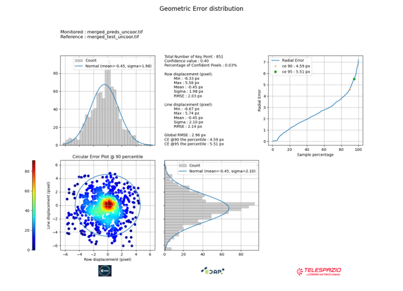

The following configuration was used:

KLT Matching:
*	minDistance: 1
*	blocksize: 25
*	maxCorners: 2000000
*	matching_winsize: 55
*	quality_level: 0.1
*	xStart: 0
*	tile_size: 5000
*  grid_step: 3
*	laplacian_kernel_size: 7
*	outliers_filtering: true

# Original README from CycleGAN and pix2pix in PyTorch

**New**:  Please check out [img2img-turbo](https://github.com/GaParmar/img2img-turbo) repo that includes both pix2pix-turbo and CycleGAN-Turbo. Our new one-step image-to-image translation methods can support both paired and unpaired training and produce better results by leveraging the pre-trained StableDiffusion-Turbo model. The inference time for 512x512 image is 0.29 sec on A6000 and 0.11 sec on A100.

Please check out [contrastive-unpaired-translation](https://github.com/taesungp/contrastive-unpaired-translation) (CUT), our new unpaired image-to-image translation model that enables fast and memory-efficient training.

We provide PyTorch implementations for both unpaired and paired image-to-image translation.

The code was written by [Jun-Yan Zhu](https://github.com/junyanz) and [Taesung Park](https://github.com/taesungp), and supported by [Tongzhou Wang](https://github.com/SsnL).

This PyTorch implementation produces results comparable to or better than our original Torch software. If you would like to reproduce the same results as in the papers, check out the original [CycleGAN Torch](https://github.com/junyanz/CycleGAN) and [pix2pix Torch](https://github.com/phillipi/pix2pix) code in Lua/Torch.

**Note**: The current software works well with PyTorch 1.4. Check out the older [branch](https://github.com/junyanz/pytorch-CycleGAN-and-pix2pix/tree/pytorch0.3.1) that supports PyTorch 0.1-0.3.

You may find useful information in [training/test tips](docs/tips.md) and [frequently asked questions](docs/qa.md). To implement custom models and datasets, check out our [templates](#custom-model-and-dataset). To help users better understand and adapt our codebase, we provide an [overview](docs/overview.md) of the code structure of this repository.

**CycleGAN: [Project](https://junyanz.github.io/CycleGAN/) |  [Paper](https://arxiv.org/pdf/1703.10593.pdf) |  [Torch](https://github.com/junyanz/CycleGAN) |
[Tensorflow Core Tutorial](https://www.tensorflow.org/tutorials/generative/cyclegan) | [PyTorch Colab](https://colab.research.google.com/github/junyanz/pytorch-CycleGAN-and-pix2pix/blob/master/CycleGAN.ipynb)**


**Pix2pix:  [Project](https://phillipi.github.io/pix2pix/) |  [Paper](https://arxiv.org/pdf/1611.07004.pdf) |  [Torch](https://github.com/phillipi/pix2pix) |
[Tensorflow Core Tutorial](https://www.tensorflow.org/tutorials/generative/pix2pix) | [PyTorch Colab](https://colab.research.google.com/github/junyanz/pytorch-CycleGAN-and-pix2pix/blob/master/pix2pix.ipynb)**


**[EdgesCats Demo](https://affinelayer.com/pixsrv/) | [pix2pix-tensorflow](https://github.com/affinelayer/pix2pix-tensorflow) | by [Christopher Hesse](https://twitter.com/christophrhesse)**


If you use this code for your research, please cite:

Unpaired Image-to-Image Translation using Cycle-Consistent Adversarial Networks.<br>
[Jun-Yan Zhu](https://www.cs.cmu.edu/~junyanz/)\*,  [Taesung Park](https://taesung.me/)\*, [Phillip Isola](https://people.eecs.berkeley.edu/~isola/), [Alexei A. Efros](https://people.eecs.berkeley.edu/~efros). In ICCV 2017. (* equal contributions) [[Bibtex]](https://junyanz.github.io/CycleGAN/CycleGAN.txt)


Image-to-Image Translation with Conditional Adversarial Networks.<br>
[Phillip Isola](https://people.eecs.berkeley.edu/~isola), [Jun-Yan Zhu](https://www.cs.cmu.edu/~junyanz/), [Tinghui Zhou](https://people.eecs.berkeley.edu/~tinghuiz), [Alexei A. Efros](https://people.eecs.berkeley.edu/~efros). In CVPR 2017. [[Bibtex]](https://www.cs.cmu.edu/~junyanz/projects/pix2pix/pix2pix.bib)

## Talks and Course
pix2pix slides: [keynote](http://efrosgans.eecs.berkeley.edu/CVPR18_slides/pix2pix.key) | [pdf](http://efrosgans.eecs.berkeley.edu/CVPR18_slides/pix2pix.pdf),
CycleGAN slides: [pptx](http://efrosgans.eecs.berkeley.edu/CVPR18_slides/CycleGAN.pptx) | [pdf](http://efrosgans.eecs.berkeley.edu/CVPR18_slides/CycleGAN.pdf)

CycleGAN course assignment [code](http://www.cs.toronto.edu/~rgrosse/courses/csc321_2018/assignments/a4-code.zip) and [handout](http://www.cs.toronto.edu/~rgrosse/courses/csc321_2018/assignments/a4-handout.pdf) designed by Prof. [Roger Grosse](http://www.cs.toronto.edu/~rgrosse/) for [CSC321](http://www.cs.toronto.edu/~rgrosse/courses/csc321_2018/) "Intro to Neural Networks and Machine Learning" at University of Toronto. Please contact the instructor if you would like to adopt it in your course.

## Colab Notebook
TensorFlow Core CycleGAN Tutorial: [Google Colab](https://colab.research.google.com/github/tensorflow/docs/blob/master/site/en/tutorials/generative/cyclegan.ipynb) | [Code](https://github.com/tensorflow/docs/blob/master/site/en/tutorials/generative/cyclegan.ipynb)

TensorFlow Core pix2pix Tutorial: [Google Colab](https://colab.research.google.com/github/tensorflow/docs/blob/master/site/en/tutorials/generative/pix2pix.ipynb) | [Code](https://github.com/tensorflow/docs/blob/master/site/en/tutorials/generative/pix2pix.ipynb)

PyTorch Colab notebook: [CycleGAN](https://colab.research.google.com/github/junyanz/pytorch-CycleGAN-and-pix2pix/blob/master/CycleGAN.ipynb) and [pix2pix](https://colab.research.google.com/github/junyanz/pytorch-CycleGAN-and-pix2pix/blob/master/pix2pix.ipynb)

ZeroCostDL4Mic Colab notebook: [CycleGAN](https://colab.research.google.com/github/HenriquesLab/ZeroCostDL4Mic/blob/master/Colab_notebooks_Beta/CycleGAN_ZeroCostDL4Mic.ipynb) and [pix2pix](https://colab.research.google.com/github/HenriquesLab/ZeroCostDL4Mic/blob/master/Colab_notebooks_Beta/pix2pix_ZeroCostDL4Mic.ipynb)

## Other implementations
### CycleGAN
<p><a href="https://github.com/leehomyc/cyclegan-1"> [Tensorflow]</a> (by Harry Yang),
<a href="https://github.com/architrathore/CycleGAN/">[Tensorflow]</a> (by Archit Rathore),
<a href="https://github.com/vanhuyz/CycleGAN-TensorFlow">[Tensorflow]</a> (by Van Huy),
<a href="https://github.com/XHUJOY/CycleGAN-tensorflow">[Tensorflow]</a> (by Xiaowei Hu),
<a href="https://github.com/LynnHo/CycleGAN-Tensorflow-2"> [Tensorflow2]</a> (by Zhenliang He),
<a href="https://github.com/luoxier/CycleGAN_Tensorlayer"> [TensorLayer1.0]</a> (by luoxier),
<a href="https://github.com/tensorlayer/cyclegan"> [TensorLayer2.0]</a> (by zsdonghao),
<a href="https://github.com/Aixile/chainer-cyclegan">[Chainer]</a> (by Yanghua Jin),
<a href="https://github.com/yunjey/mnist-svhn-transfer">[Minimal PyTorch]</a> (by yunjey),
<a href="https://github.com/Ldpe2G/DeepLearningForFun/tree/master/Mxnet-Scala/CycleGAN">[Mxnet]</a> (by Ldpe2G),
<a href="https://github.com/tjwei/GANotebooks">[lasagne/Keras]</a> (by tjwei),
<a href="https://github.com/simontomaskarlsson/CycleGAN-Keras">[Keras]</a> (by Simon Karlsson),
<a href="https://github.com/Ldpe2G/DeepLearningForFun/tree/master/Oneflow-Python/CycleGAN">[OneFlow]</a> (by Ldpe2G)
</p>
</ul>

### pix2pix
<p><a href="https://github.com/affinelayer/pix2pix-tensorflow"> [Tensorflow]</a> (by Christopher Hesse),
<a href="https://github.com/Eyyub/tensorflow-pix2pix">[Tensorflow]</a> (by Eyyüb Sariu),
<a href="https://github.com/datitran/face2face-demo"> [Tensorflow (face2face)]</a> (by Dat Tran),
<a href="https://github.com/awjuliani/Pix2Pix-Film"> [Tensorflow (film)]</a> (by Arthur Juliani),
<a href="https://github.com/kaonashi-tyc/zi2zi">[Tensorflow (zi2zi)]</a> (by Yuchen Tian),
<a href="https://github.com/pfnet-research/chainer-pix2pix">[Chainer]</a> (by mattya),
<a href="https://github.com/tjwei/GANotebooks">[tf/torch/keras/lasagne]</a> (by tjwei),
<a href="https://github.com/taey16/pix2pixBEGAN.pytorch">[Pytorch]</a> (by taey16)
</p>
</ul>

## Prerequisites
- Linux or macOS
- Python 3
- CPU or NVIDIA GPU + CUDA CuDNN

## Getting Started
### Installation

- Clone this repo:
```bash
git clone https://github.com/junyanz/pytorch-CycleGAN-and-pix2pix
cd pytorch-CycleGAN-and-pix2pix
```

- Install [PyTorch](http://pytorch.org) and 0.4+ and other dependencies (e.g., torchvision, [visdom](https://github.com/facebookresearch/visdom) and [dominate](https://github.com/Knio/dominate)).
  - For pip users, please type the command `pip install -r requirements.txt`.
  - For Conda users, you can create a new Conda environment using `conda env create -f environment.yml`.
  - For Docker users, we provide the pre-built Docker image and Dockerfile. Please refer to our [Docker](docs/docker.md) page.
  - For Repl users, please click [](https://repl.it/github/junyanz/pytorch-CycleGAN-and-pix2pix).

### CycleGAN train/test
- Download a CycleGAN dataset (e.g. maps):
```bash
bash ./datasets/download_cyclegan_dataset.sh maps
```
- To view training results and loss plots, run `python -m visdom.server` and click the URL http://localhost:8097.
- To log training progress and test images to W&B dashboard, set the `--use_wandb` flag with train and test script
- Train a model:
```bash
#!./scripts/train_cyclegan.sh
python train.py --dataroot ./datasets/maps --name maps_cyclegan --model cycle_gan
```
To see more intermediate results, check out `./checkpoints/maps_cyclegan/web/index.html`.
- Test the model:
```bash
#!./scripts/test_cyclegan.sh
python test.py --dataroot ./datasets/maps --name maps_cyclegan --model cycle_gan
```
- The test results will be saved to a html file here: `./results/maps_cyclegan/latest_test/index.html`.

### pix2pix train/test
- Download a pix2pix dataset (e.g.[facades](http://cmp.felk.cvut.cz/~tylecr1/facade/)):
```bash
bash ./datasets/download_pix2pix_dataset.sh facades
```
- To view training results and loss plots, run `python -m visdom.server` and click the URL http://localhost:8097.
- To log training progress and test images to W&B dashboard, set the `--use_wandb` flag with train and test script
- Train a model:
```bash
#!./scripts/train_pix2pix.sh
python train.py --dataroot ./datasets/facades --name facades_pix2pix --model pix2pix --direction BtoA
```
To see more intermediate results, check out  `./checkpoints/facades_pix2pix/web/index.html`.

- Test the model (`bash ./scripts/test_pix2pix.sh`):
```bash
#!./scripts/test_pix2pix.sh
python test.py --dataroot ./datasets/facades --name facades_pix2pix --model pix2pix --direction BtoA
```
- The test results will be saved to a html file here: `./results/facades_pix2pix/test_latest/index.html`. You can find more scripts at `scripts` directory.
- To train and test pix2pix-based colorization models, please add `--model colorization` and `--dataset_mode colorization`. See our training [tips](https://github.com/junyanz/pytorch-CycleGAN-and-pix2pix/blob/master/docs/tips.md#notes-on-colorization) for more details.

### Apply a pre-trained model (CycleGAN)
- You can download a pretrained model (e.g. horse2zebra) with the following script:
```bash
bash ./scripts/download_cyclegan_model.sh horse2zebra
```
- The pretrained model is saved at `./checkpoints/{name}_pretrained/latest_net_G.pth`. Check [here](https://github.com/junyanz/pytorch-CycleGAN-and-pix2pix/blob/master/scripts/download_cyclegan_model.sh#L3) for all the available CycleGAN models.
- To test the model, you also need to download the  horse2zebra dataset:
```bash
bash ./datasets/download_cyclegan_dataset.sh horse2zebra
```

- Then generate the results using
```bash
python test.py --dataroot datasets/horse2zebra/testA --name horse2zebra_pretrained --model test --no_dropout
```
- The option `--model test` is used for generating results of CycleGAN only for one side. This option will automatically set `--dataset_mode single`, which only loads the images from one set. On the contrary, using `--model cycle_gan` requires loading and generating results in both directions, which is sometimes unnecessary. The results will be saved at `./results/`. Use `--results_dir {directory_path_to_save_result}` to specify the results directory.

- For pix2pix and your own models, you need to explicitly specify `--netG`, `--norm`, `--no_dropout` to match the generator architecture of the trained model. See this [FAQ](https://github.com/junyanz/pytorch-CycleGAN-and-pix2pix/blob/master/docs/qa.md#runtimeerror-errors-in-loading-state_dict-812-671461-296) for more details.

### Apply a pre-trained model (pix2pix)
Download a pre-trained model with `./scripts/download_pix2pix_model.sh`.

- Check [here](https://github.com/junyanz/pytorch-CycleGAN-and-pix2pix/blob/master/scripts/download_pix2pix_model.sh#L3) for all the available pix2pix models. For example, if you would like to download label2photo model on the Facades dataset,
```bash
bash ./scripts/download_pix2pix_model.sh facades_label2photo
```
- Download the pix2pix facades datasets:
```bash
bash ./datasets/download_pix2pix_dataset.sh facades
```
- Then generate the results using
```bash
python test.py --dataroot ./datasets/facades/ --direction BtoA --model pix2pix --name facades_label2photo_pretrained
```
- Note that we specified `--direction BtoA` as Facades dataset's A to B direction is photos to labels.

- If you would like to apply a pre-trained model to a collection of input images (rather than image pairs), please use `--model test` option. See `./scripts/test_single.sh` for how to apply a model to Facade label maps (stored in the directory `facades/testB`).

- See a list of currently available models at `./scripts/download_pix2pix_model.sh`

## [Docker](docs/docker.md)
We provide the pre-built Docker image and Dockerfile that can run this code repo. See [docker](docs/docker.md).

## [Datasets](docs/datasets.md)
Download pix2pix/CycleGAN datasets and create your own datasets.

## [Training/Test Tips](docs/tips.md)
Best practice for training and testing your models.

## [Frequently Asked Questions](docs/qa.md)
Before you post a new question, please first look at the above Q & A and existing GitHub issues.

## Custom Model and Dataset
If you plan to implement custom models and dataset for your new applications, we provide a dataset [template](data/template_dataset.py) and a model [template](models/template_model.py) as a starting point.

## [Code structure](docs/overview.md)
To help users better understand and use our code, we briefly overview the functionality and implementation of each package and each module.

## Pull Request
You are always welcome to contribute to this repository by sending a [pull request](https://help.github.com/articles/about-pull-requests/).
Please run `flake8 --ignore E501 .` and `python ./scripts/test_before_push.py` before you commit the code. Please also update the code structure [overview](docs/overview.md) accordingly if you add or remove files.

## Citation
If you use this code for your research, please cite our papers.
```
@inproceedings{CycleGAN2017,
  title={Unpaired Image-to-Image Translation using Cycle-Consistent Adversarial Networks},
  author={Zhu, Jun-Yan and Park, Taesung and Isola, Phillip and Efros, Alexei A},
  booktitle={Computer Vision (ICCV), 2017 IEEE International Conference on},
  year={2017}
}


@inproceedings{isola2017image,
  title={Image-to-Image Translation with Conditional Adversarial Networks},
  author={Isola, Phillip and Zhu, Jun-Yan and Zhou, Tinghui and Efros, Alexei A},
  booktitle={Computer Vision and Pattern Recognition (CVPR), 2017 IEEE Conference on},
  year={2017}
}
```

## Other Languages
[Spanish](docs/README_es.md)

## Related Projects
**[contrastive-unpaired-translation](https://github.com/taesungp/contrastive-unpaired-translation) (CUT)**<br>
**[CycleGAN-Torch](https://github.com/junyanz/CycleGAN) |
[pix2pix-Torch](https://github.com/phillipi/pix2pix) | [pix2pixHD](https://github.com/NVIDIA/pix2pixHD)|
[BicycleGAN](https://github.com/junyanz/BicycleGAN) | [vid2vid](https://tcwang0509.github.io/vid2vid/) | [SPADE/GauGAN](https://github.com/NVlabs/SPADE)**<br>
**[iGAN](https://github.com/junyanz/iGAN) | [GAN Dissection](https://github.com/CSAILVision/GANDissect) | [GAN Paint](http://ganpaint.io/)**

## Cat Paper Collection
If you love cats, and love reading cool graphics, vision, and learning papers, please check out the Cat Paper [Collection](https://github.com/junyanz/CatPapers).

## Acknowledgments
Our code is inspired by [pytorch-DCGAN](https://github.com/pytorch/examples/tree/master/dcgan).
